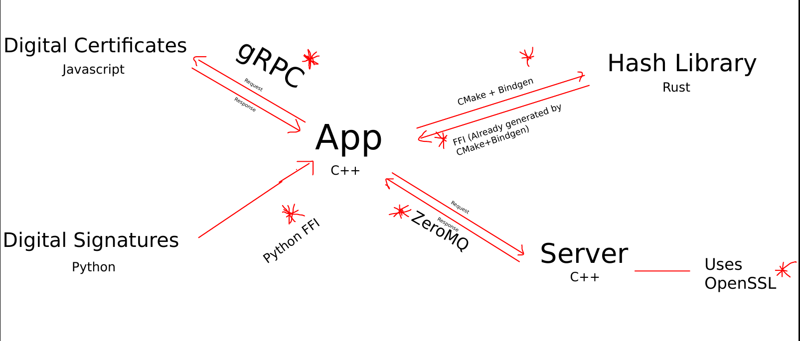

# Crypto... Testbed

A C++ Application, doing these things... with a lot of tech.

Run `client --help` for help.



## Testbed

This is a testbed application (originally wasn't), so it's INTENTIONALLY much more complex than it should be... though as always I did start very simple at beginning.

For me it's a place to try some **co-existence** things:

* C++ code calls methods in Rust; Used build.rs for the first time in rust to create the bindings
* CMake builds rust code too, first time
* Rust code and C++ both using OpenSSL (Initially was doing that part in Rust, then wanted some fun... C++)... was a first time working with OpenSSL in C++
* Setup networking with libzmq, first time doing so in a C++ app
* Used argparse library, first time in C++, though have used different CLI parsers earlier

Some things I have done before, but those that add a cherry on top of the cake
* Use protocol buffers for serialisation/deserialisation
* Using CPM.cmake... Iske baare me kya hi bole, bahut gadar hai, bahut help karta hai

## Building

Firstly install `openssl (`openssl` in apt) and protobuf (`protocol-compiler` in apt)

```sh
cmake -B build
cmake --build build
```

Then to run:
* Server: `./build/server`
* Client: `./build/client --help`

> 2. Basic study of cryptographic concepts and practising them with either javascript/python/rust libraries or Linux command CLI(sha256sum, base64, openssl),
>
>    Encoding/Decoding
>
>    Hashing
>
>    Digital Signatures
>
>    Encryption/Decryption
>

Extras Planned:
> * Serialisation/Deserialisation (using protobuf)
>
> * Digital Certificates

